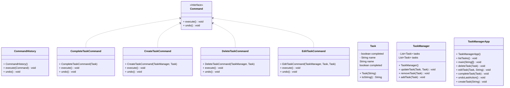

# Integrantes del equipo
- Juan David Marulanda
- Jefferson Morales Gonzalez
- Jhan Castro Vargas
- Laura Sofia Guio Camargo
- Natacha Castrillon
- Ruben Dario Suarez Amaya

## UML Diagrams:

### Ejercicio 4 Sistema de Gestión de Tareas

## Problema vs patron seleccionado:
- ### Problema 1: Prototype
  - Prototype es un patrón de diseño creacional que nos permite copiar objetos existentes sin que el código dependa de sus clases.

- ### Problema 2

  La empresa está desarrollando una aplicación de mensajería en tiempo real que permite a los usuarios comunicarse desde múltiples dispositivos. Cada vez que un usuario recibe un nuevo mensaje, todos los dispositivos del usuario deben ser notificados para que el mensaje se muestre en cada uno de ellos. Para mantener la flexibilidad y desacoplar la lógica de notificación de la aplicación principal. 

  El patrón que escoja deberá permitir:

  1. Notificación en Tiempo Real: Cada dispositivo del usuario debe recibir una notificación cuando llegue un nuevo mensaje.
  2. Desacoplamiento: La aplicación de mensajería debe poder notificar a cualquier número de dispositivos sin saber detalles específicos sobre cada uno de ellos.
  3. Flexibilidad: Los dispositivos pueden ser añadidos o eliminados en tiempo de ejecución sin necesidad de modificar la lógica principal de la aplicación.

#### Patron seleccionado : Observer
- > Observer es un patrón de diseño de comportamiento que te permite definir un mecanismo de suscripción para notificar a varios objetos sobre cualquier evento que le suceda al objeto que están observando, que en este caso es objeto de observacion es el mensaje.
  
Explicación:

- Basados en el planteamiento del problema, detectamos dos puntos claves importantes: 
 
   > Tiempo Real / Recibe un nuevo mensaje.

  > Esto quiere decir que un evento debe disparar una acción en tiempo real, este evento sería la recepción de un nuevo mensaje y la acción es la notificación a los diferentes dispositivos por lo cual debe existir un observador que a la recepción del mensaje dispare el envío de notificaciones, esta básicamente es la problemática que resuelve el patrón observador.

- ### Problema 3: Template (ninguno le pego)
  - Template Method es un patrón de diseño de comportamiento que define el esqueleto de un algoritmo en la superclase pero permite que las subclases sobrescriban pasos del algoritmo sin cambiar su estructura.

- ### Problema 4: Command (ninguno le pego y tenemos dudas)
  - Command es un patrón de diseño de comportamiento que convierte una solicitud en un objeto independiente que contiene toda la información sobre la solicitud. Esta transformación te permite parametrizar los métodos con diferentes solicitudes, retrasar o poner en cola la ejecución de una solicitud y soportar operaciones que no se pueden realizar. 
  
- ### Problema 5: Decorator
  - Decorator es un patrón de diseño estructural que te permite añadir funcionalidades a objetos colocando estos objetos dentro de objetos encapsuladores especiales que contienen estas funcionalidades